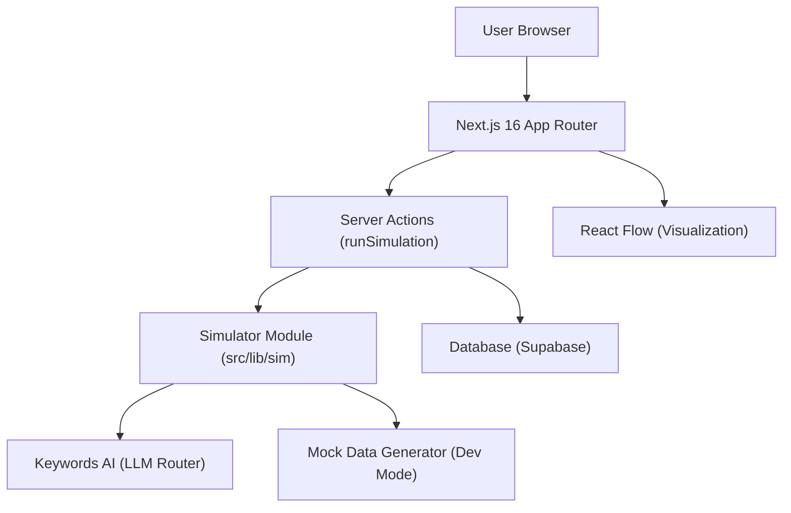

# Technical Architecture Document - Synthetic Pulse MVP

## 1. Architecture Overview



## 2. Technology Stack

- **Frontend Framework**: Next.js 16 (App Router)
- **Language**: TypeScript
- **Styling**: Tailwind CSS + shadcn/ui + clsx/tailwind-merge
- **Animation**: Framer Motion (for floating cards and staggered entry)
- **Visualization**: React Flow (Decision Tree), Lucide React (Icons)
- **Backend/Database**: Supabase
- **AI/LLM**: Keywords AI (Router) - API call skeleton setup only

## 3. Directory Structure

```
src/
  app/
    layout.tsx        # Global layout (Dark theme provider)
    page.tsx          # Landing / Input Form
    run/
      [id]/
        page.tsx      # Command Center (Results)
    history/
      page.tsx        # Recent simulations
  components/
    ui/               # shadcn/ui components
    sim/              # Simulation specific components
      PersonaCard.tsx
      RiskBlock.tsx
      DecisionTree.tsx
      ResultPanels.tsx
  lib/
    sim/
      simulator.ts    # Main orchestrator
      types.ts        # Shared TypeScript interfaces
      personaPacks.ts # Seed data
      mockData.ts     # Static mock responses for testing
    supabase.ts       # Supabase client
    utils.ts          # Helpers
```

## 4. Data Models (Types)

### 4.1 Simulation Result
```typescript
export interface SimulationResult {
  runId: string;
  createdAt: string; // ISO date
  seed: number;
  mode: 'single' | 'compare';
  ideas: Idea[];
  personas: Persona[];
  arguments: Argument[]; // Flatted list or map keyed by personaId
  risks: Risk[];
  scorecard: Scorecard;
  recommendation: Recommendation;
  plan: PlanItem[];
}
```

### 4.2 Core Entities
```typescript
export interface Idea {
  id: string;
  title: string;
  description: string;
}

export interface Persona {
  id: string;
  name: string;
  role: string; // e.g., "Gen Z Rights Activist"
  tags: string[]; // Psychographics
  avatarUrl?: string;
}

export interface Argument {
  personaId: string;
  ideaId: string;
  stance: 'support' | 'oppose' | 'neutral';
  forPoints: string[];
  againstPoints: string[];
  thoughtProcess: string;
}

export interface Risk {
  id: string;
  type: string; // e.g., "Legal", "PR", "Technical"
  severity: 'low' | 'medium' | 'high' | 'critical';
  likelihood: 'low' | 'medium' | 'high';
  mitigation: string;
}
```

## 5. Key Workflows

### 5.1 Run Simulation
1. User submits form on `/`.
2. `runSimulation` Server Action is called.
3. Simulator checks for `mock` flag or uses LLM.
4. Results are generated and validated against schema.
5. Results are saved to Supabase.
6. User is redirected to `/run/[id]`.

### 5.2 Command Center Rendering
1. `/run/[id]` fetches data server-side (or via client hook if streaming).
2. `PersonaCard` components initialize with random float animation parameters (Framer Motion).
3. `DecisionTree` builds a node graph from the `plan` and `arguments`.

## 6. Database Schema (Supabase)

```sql
-- Simulations Table
CREATE TABLE simulations (
  id UUID PRIMARY KEY DEFAULT gen_random_uuid(),
  created_at TIMESTAMP WITH TIME ZONE DEFAULT NOW(),
  mode TEXT NOT NULL, -- "single" | "compare"
  input_json JSONB,   -- Stored input params
  result_json JSONB   -- Stored full JSON result
);

-- Enable Row Level Security (RLS)
ALTER TABLE simulations ENABLE ROW LEVEL SECURITY;

-- Allow public read access (for MVP demo purposes, or restrict as needed)
CREATE POLICY "Allow public read access" ON simulations FOR SELECT USING (true);

-- Allow authenticated/anon insert access
CREATE POLICY "Allow anon insert access" ON simulations FOR INSERT WITH CHECK (true);
```

## 7. Performance & Constraints
- **Response Time**: <45s for full generation.
- **Client Performance**: Optimized for >60fps animation on desktop (backdrop-blur usage carefully monitored).
- **Responsive**: Desktop-first "War Room" layout; stacks vertically on mobile.
```
